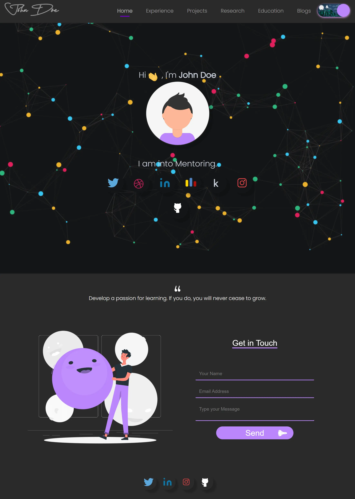

# Amazing Portfolio Website Practice

This cloned website is another milestone in my learning journey, where I recreated a professional design to understand its structure, functionality, and aesthetics. By adding my unique touches and optimizations, I aimed to push the boundaries of my skills and creativity, proving my capability to deliver high-quality, custom web solutions. 
I created this website on <b> Octuber 2024 </b>, as a role in <b> Coding</b>.

